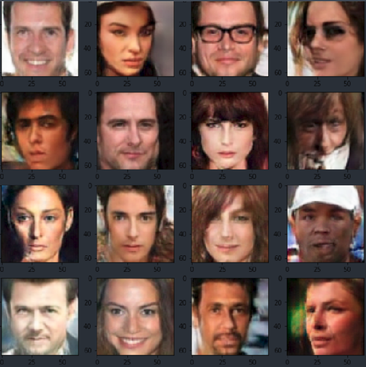

# Projects

## Face GAN — Machine Learning Project
Trained and Deployed a GAN that learns to generate faces .The dataset used to train the model is CelebA which consists of over 200K of celebrities faces from all over the world. The model was trained on TPU that reduces the training time significantly over GPU.
https://github.com/ShubhamShaswat/FaceGan

## Discord Chat Analysis — Hackathon,Devpost
Successfully built a Django App which uses a NLP API to monitor the real time sentiments of the chats in a Discord channel.The project was the part of a hackathon on Devpost.com.
https://github.com/ShubhamShaswat/expert-ai

## Overhead Person Detection — Machine Learning Project
The goal of the project was to train a model that detects multiple people from a single overhead depth camera with high reliability.The dataset used to train the model is GOTPD (Geintra Overhead ToF People Detection dataset), a multimodal database (depth, and infrared data).
https://github.com/ShubhamShaswat/Overhead-Person-Detection
